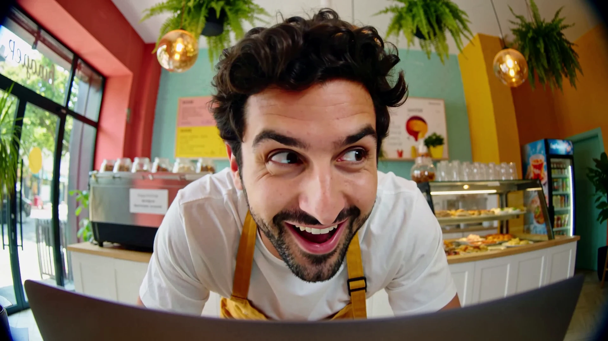
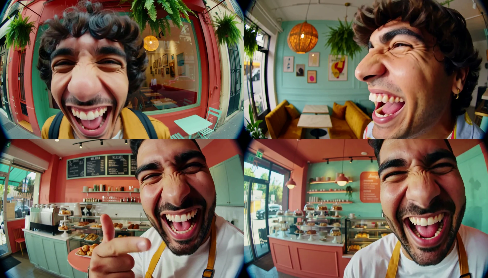
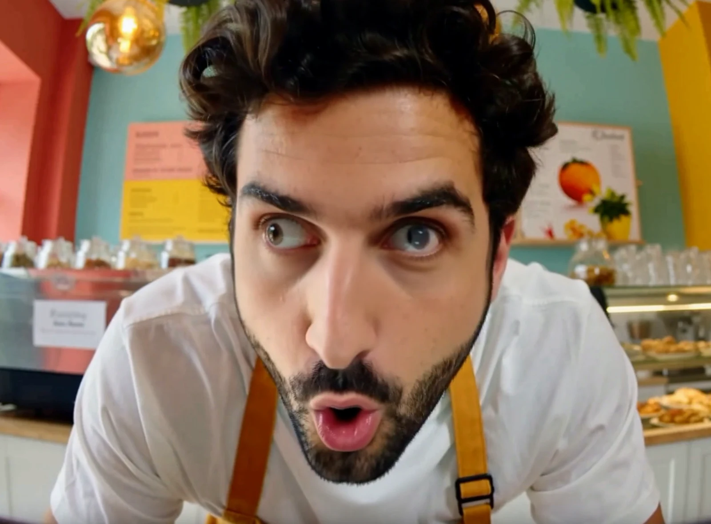
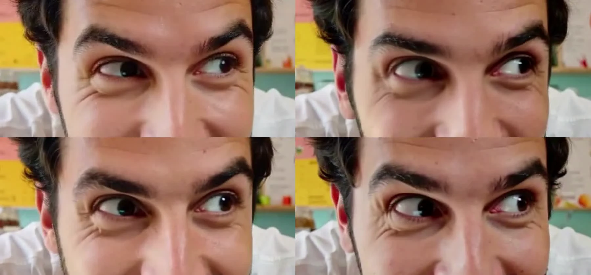
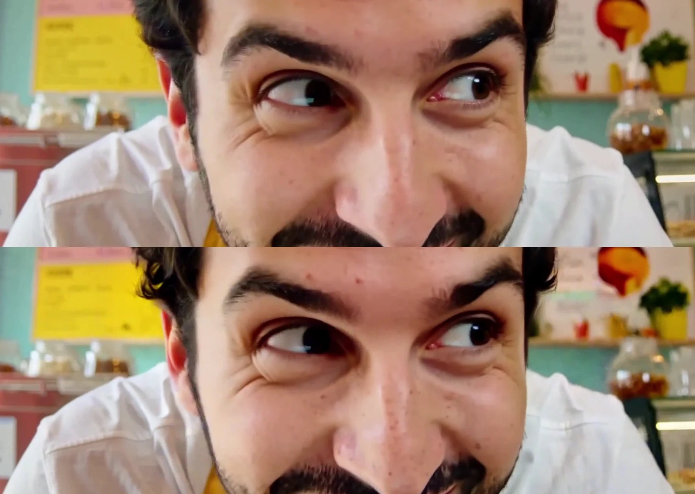

# SyncTile for MiniMax H3

**4.9x faster local MiniMax H3 generation, and native-resolution 4K (3840 x 2160) through synchronized tiles, on one RTX 4090.**



MiniMax H3 is an open-weights video model that also generates sound. On a 24 GB card it tops out around 1344 x 768, and the default 25 steps take 562 s for a 5.9 s clip. This repo comes out of a series of measured tests on what actually helps:

- **fast mode:** 8-step distillation LoRA + ComfyUI's int8 attention backend. **562 s -> about 115 s (4.9x)**, picture stays close to the 8-step reference.
- **4k mode (SyncTile):** the fast clip is enlarged in latent space by the MiniMax H3 latent upscaler, then re-sampled as nine overlapping tiles whose latents are **blended after every sampling step**, and decoded once. No seams, no eye drift between tiles, **about 11 minutes for a 5 s 4K clip**.

Full write-up with videos: [pixedi.com/lab/minimax-h3-4k-synctile](https://pixedi.com/lab/minimax-h3-4k-synctile). Demo clips (4K originals) are attached to the [latest release](../../releases).

## Demo (original files, open full screen)

| Clip | What to look at |
|---|---|
| [Drone canyon, 3840 x 2160](https://github.com/alaintural/synctile-h3/releases/download/v0.1.0/drone-canyon-4k-synctile.mp4) (51 MB) | Fast camera move, kayaker crossing the tile seams |
| [Café close-up, 3840 x 2160](https://github.com/alaintural/synctile-h3/releases/download/v0.1.0/cafe-closeup-4k-synctile.mp4) (22 MB) | Eyes, beard and skin across the seams |
| [Same café clip through MMH3 Split Upscale](https://github.com/alaintural/synctile-h3/releases/download/v0.1.0/cafe-closeup-4k-split-upscale.mp4) | Compare face position and texture in motion |
| [SeedVR2 7B vs SyncTile, 1:1 crop](https://github.com/alaintural/synctile-h3/releases/download/v0.1.0/seedvr2-vs-synctile-crop.mp4) | Left SeedVR2, right SyncTile: texture shimmer |
| [25 steps vs 8 steps + int8](https://github.com/alaintural/synctile-h3/releases/download/v0.1.0/25-steps-vs-8-steps-int8.mp4) | 562 s vs 114 s, same seed |

## What is new here

Tiled upscaling is not new. MultiDiffusion (Bar-Tal et al., 2023) showed that diffusion tiles stay coherent if they are fused at every denoising step, and the MiniMax H3 community already has tiled upscalers (MMH3 Split Upscale). What this repo adds:

1. **Per-step synchronization on MiniMax H3's joint audio-video latent.** Each tile runs one sampling step at a time through ComfyUI. After every step all tiles are blended with linear overlap weights in latent space and the next step starts from the shared result. The GPU only ever holds one tile.
2. **One shared noise image for the whole canvas**, cut per tile, so overlaps start identical.
3. **Latent upscaling instead of pixel upscaling as the input**, and **one decode of the full canvas**, so there is no pixel seam to hide.
4. **Measured, including what did not work** (below), plus a shimmer metric that matched what we saw in playback when a standard sharpness score did not.

```
fast clip 1344x768 ──VAE──> latent ──MiniMax H3 latent upscaler──> 4K latent (3840x2160)
                                                                        │ + shared noise at sigma 0.878
        for step in 6..8:                                              ▼
            for each of 9 tiles (one at a time):  MiniMax H3, 1 step ──> tile latent
            blend all 9 tiles (overlap ramps) ──> canvas latent        (tiles agree before the next step)
                                                                        ▼
                                            decode once ──> 4K video ──> light unsharp mask (optional)
```

## Results

All numbers on one RTX 4090, same prompts and seed. Details and caveats in the write-up.

### Speed (1344 x 768, 141 frames)

| Setup | Time | Speed-up | SSIM motion / face |
|---|---|---|---|
| 25 steps, no speed-up | 562 s | 1.00x | reference |
| EasyCache 0.20 | 325-369 s | 1.5-1.7x | 0.85 / 0.96 |
| LazyCache 0.20 | 346-391 s | 1.4-1.6x | 0.85 / 0.96 |
| TeaCache 0.25 | 195 s | 2.9x | 0.58 / 0.75 (composition drifts) |
| int8 attention | 304-307 s | 1.85x | 0.70 / 0.91 |
| 8-step LoRA | 199 s | 2.8x | own reference |
| **8-step LoRA + int8 attention** | **114-117 s** | **4.9x** | 0.69 / 0.92 vs 8 steps |
| SageAttention 2.2 | 1,127 s | 0.5x | bit-identical output |


### Holding tiles together (2688 x 1536, 5 s)

| Method | Time | Result |
|---|---|---|
| Four quarters generated separately | 406 s | Four different scenes |
| Four tiles, each finished on its own | 430-438 s | Moving objects shift, eyes can disagree |
| + fifth tile over the seams | 541-550 s | Fixes the center only, slowest |
| + frequency lock | 430-438 s | Double edges on moving objects |
| **SyncTile (per-step sync)** | **243-272 s** | No seam, eyes agree |








### 4K routes compared (same base clips, 5 s, café / drone)

| Route | Time | Fidelity to base (SSIM) | Shimmer (plain resize ≈ 1.5) |
|---|---|---|---|
| **SyncTile** | **542 / 549 s** | 0.87 / 0.81 | **1.62 / 1.60** |
| MMH3 Split Upscale | 605 / 601 s | 0.84 / 0.79 | 1.68 / 1.66 |
| SeedVR2 7B (block swap) | 2,097 / 2,085 s | 0.96 / 0.95 | 3.00 / 2.45 |

*Shimmer* = mean frame-to-frame change of the finest detail layer (frame minus Gaussian blur, sigma 2) on a full-resolution 1024 px center crop. SeedVR2 looked sharpest on single frames and scored highest on Laplacian sharpness, but its texture boiled in playback; the shimmer score caught that. Split Upscale gave more fine texture and shifted the face slightly. SeedVR2 ran out of memory at 4K with default settings on 24 GB.



The optional last step, an unsharp mask (5 x 5, amount 1.0), was matched to a manual sharpening pass in an editor: fine detail +27%, shimmer 2.1.

## Quick start

Requirements:

- ComfyUI recent enough to include the MiniMax H3 nodes, `ModelAttentionBackend` ("comfy kitchen attention") and the LTXV audio-video latent nodes
- Custom node [Comfyui_Minimax_h3_latent_Upscaler](https://github.com/LBH-123-AI/Comfyui_Minimax_h3_latent_Upscaler) and its 3D model in `models/latent_upscale_models`
- MiniMax H3 weights, text encoder, VAEs and the 8-step turbo LoRA (file names at the top of `synctile_h3.py`; edit them if yours differ)
- Python 3.10+ with `torch` and `safetensors` (`pip install -r requirements.txt`), and `ffmpeg`
- 24 GB VRAM for 4K (tested on an RTX 4090)

Start ComfyUI, then:

```bash
export COMFYUI_INPUT=/path/to/ComfyUI/input
export COMFYUI_OUTPUT=/path/to/ComfyUI/output    # ComfyUI's output folder (or its --output-directory)

python synctile_h3.py fast "A drone shot over a red-rock canyon at golden hour" --seconds 5
python synctile_h3.py 4k   "A drone shot over a red-rock canyon at golden hour" --seconds 5 --name canyon
python synctile_h3.py 4k   --prompt-file prompt.txt --sharpen 0      # no sharpening
```

Output goes to `./synctile_output/`: the fast 1344 x 768 clip, the 4K clip, the sharpened 4K clip and a JSON log. Intermediate latents land in `<ComfyUI output>/synctile/_tmp/` and can be deleted.

## Limits

- 4K was tested on 5-second clips (124 frames). Longer clips make every tile heavier and may not fit in 24 GB.
- MiniMax H3 length rule: 17n + 5 frames at 24 fps; `--seconds` is rounded.
- The 4K pass re-draws fine detail, so fast-moving objects can move a few pixels against the base clip. Fast water and mist stay as soft as in the base.
- Refining the last 4 of 8 steps instead of 3 took 2-4 minutes longer, added no visible detail and moved things slightly.
- This is a script that drives ComfyUI's HTTP API, not a ComfyUI node.

## Safety

- Plain, readable Python. No compiled code, no network access except your own ComfyUI on localhost, no telemetry, nothing is downloaded.
- Only `.safetensors` latents are written and read; no pickle files.
- Writes only to ComfyUI's input and output folders and to `--out`.
- Tiles are processed one at a time, so peak VRAM equals one 1472 x 896 tile.

## Model license

This repo contains code only, no model weights. Bring your own MiniMax H3 weights and check the MiniMax H3 license terms for your region and use case. The MIT license below covers this code, not the model.

## Credits

- MiniMax for releasing MiniMax H3
- ComfyUI and its MiniMax H3 / LTXV latent nodes
- MultiDiffusion: Bar-Tal, Yariv, Lipman, Dekel, *MultiDiffusion: Fusing Diffusion Paths for Controlled Image Generation*, ICML 2023
- [Comfyui_Minimax_h3_latent_Upscaler](https://github.com/LBH-123-AI/Comfyui_Minimax_h3_latent_Upscaler) (latent upscaler, MMH3 Split Upscale)
- [ComfyUI-MiniMaxH3-TeaCache](https://github.com/Icyoung/ComfyUI-MiniMaxH3-TeaCache): in our tests the step counter was not reset when the same settings ran twice, so the second run used no caching; resetting `state` when `step_idx >= total_steps` fixed it
- [pepikir/minimax-h3-speedup](https://github.com/pepikir/minimax-h3-speedup) for the EasyCache notes

## Citation

If SyncTile helps your work, please cite it (see `CITATION.cff`):

```
Tural, A. (2026). SyncTile for MiniMax H3: synchronized-tile 4K refinement and speed benchmarks. Pixedi AI Lab.
https://github.com/alaintural/synctile-h3
```

## License

MIT. Copyright (c) 2026 Alain Tural, Pixedi.

Made by [Alain Tural](https://github.com/alaintural) at [Pixedi AI Lab](https://pixedi.com/lab).
